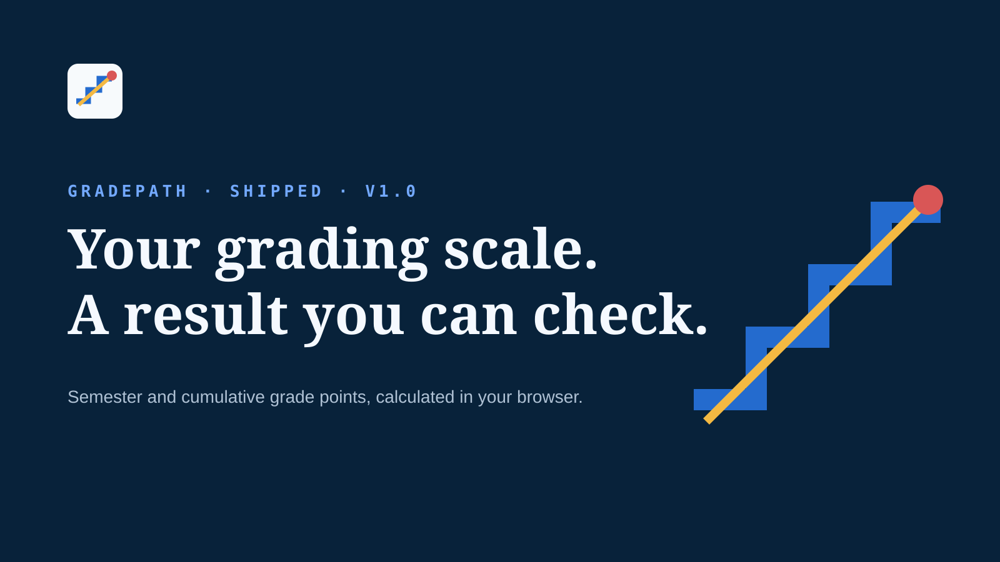

<p align="center"></p>

# GradeForge



GradeForge is a browser-local SGPA and CGPA calculator I built for students who want accurate calculations without wrestling with spreadsheets every semester.

[Open GradeForge](https://gradeforge.poorvithmp.com) · [My Portfolio](https://poorvithmp.com) · [GitHub](https://github.com/poorvith-mp/gradeforge)

## Why I built this

Most online GPA calculators are packed with ads, break when your university changes grading rules, or force you to sign up. I wanted something fast, clean, and completely private that works offline in your browser.

## Features

- Presets for VTU CBCS, Anna University, Mumbai University, KTU, JNTU, standard 10-point, and US 4.0 GPA scales.
- Custom scale builder if your college uses custom grade points.
- Target CGPA / What-If planner to figure out the exact SGPA you need in upcoming semesters.
- SGPA progression chart and credit breakdown.
- Export to CSV or JSON backup, plus a printable transcript format.
- 100% browser-local storage. No accounts, no database, no tracking of your grades.

## Formula

```text
SGPA = Σ(credit × grade point) ÷ Σ(credit)
```

CGPA uses the same credit-weighted math across all semesters. Empty rows or incomplete credit entries are skipped automatically.

## Running locally

```bash
git clone https://github.com/poorvith-mp/gradeforge.git
cd gradeforge
npm install
npm run dev
```

To build the production bundle:

```bash
npm run build
```

The output files go straight to `dist/`.

## Contributing

Pull requests are welcome. Check [CONTRIBUTING.md](CONTRIBUTING.md) for how to add university presets or fix bugs.

## License

MIT License. See [LICENSE](LICENSE) for details.

## Author

Built by [Poorvith M P](https://poorvithmp.com). You can find me on [GitHub](https://github.com/poorvith-mp).
